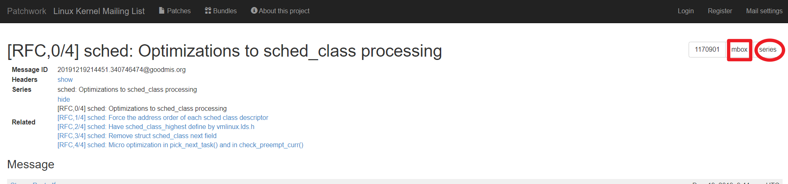
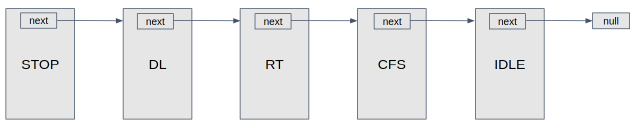
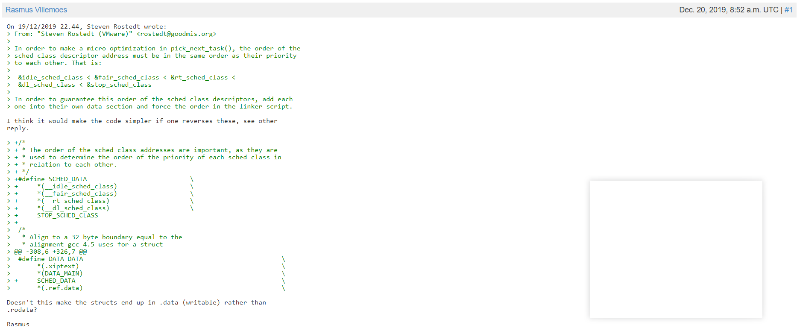

# 对内核补丁 [sched: Optimizations to sched_class processing](https://lore.kernel.org/patchwork/cover/1170901/) 详解
-------
## <center>简要说明</center>


当前处于 : `[RFC,0/4] sched: Optimizations to sched_class processing`
这里概述这组补丁做了什么,后续四篇每篇表示一次有序的 `patch`。

-------
## <center>概述</center>
在进程调度子系统中, `check_preempt_curr`需要根据调度类描述符的优先级比较判断某任务是否可以抢占当前就绪队列运行的任务,但由于各个调度类描述符(`stop_sched_class`就是一个调度类描述符)以链表的数据格式连接,且链表中元素由高优先级调度类描述符到低优先级调度类描述符,结构如下所示 :
```
struct sched_class {
        const struct sched_class *next;
        void (*enqueue_task) (struct rq *rq, struct task_struct *p, int flags);
        void (*dequeue_task) (struct rq *rq, struct task_struct *p, int flags);
        struct task_struct *(*pick_next_task) (struct rq *rq, struct task_struct *prev, 
                                struct rq_flags *rf);
        /* many fields omitted */
};
```


故而如若要比较调度类描述符之间的优先级只能通过 :
```
void check_preempt_curr(struct rq *rq, struct task_struct *p, int flags)
{
        const struct sched_class *class;

        if (p->sched_class == rq->curr->sched_class) {
                rq->curr->sched_class->check_preempt_curr(rq, p, flags);
        } else {
                for_each_class(class) {
                        if (class == rq->curr->sched_class)
                                break;
                        if (class == p->sched_class) {
                                resched_curr(rq);
                                break;
                        }
                }
        }

        /*
         * A queue event has occurred, and we're going to schedule.  In
         * this case, we can save a useless back to back clock update.
         */
        if (task_on_rq_queued(rq->curr) && test_tsk_need_resched(rq->curr))
                rq_clock_skip_update(rq);
}
```
在 `else` 作用域中,我们可以看到`check_preempt_curr` 通过遍历`调度类描述符链表`比较优先级,如若先遍历到`就绪队列当前运行任务`(`rq->curr->sched_class`)则表示`就绪队列当前运行任务`的优先级大于等于`需要抢占核的任务`,则不可抢占,否则表示可以抢占。**但是这种遍历的方式既不高效,也缺失可读性**,该`patch`组便是**利用链接脚本将各调度类描述符之间以数组的数据格式有序链接(这里有序指优先级越高地址值越低,或优先级越低地址值越高,这里之所以有两种选择的原因是后续探讨哪种更好)**。这样就可以**直接通过比较地址值来进行优先级比较**。很好地解决了当前问题和类似问题。

-------
## <center>[RFC,0/4] sched: Optimizations to sched_class processing</center>
### Message
```
As Kirill made a micro-optimization to the processing of pick_next_task()
that required the address locations of the sched_class descriptors to
be that of their priority to one another. This required a linker
script modification to guarantee that order.
```
这里 [Kirill made a micro-optimization to the processing of pick_next_task()](https://lore.kernel.org/patchwork/patch/1170899/) 
指`[RFC,4/4]` 中对 `pick_next_task` 和 `check_preempt_curr` 做出的修改(通过比较地址值来判断优先级,进行优化)。做出这个修改是基于调度类描述符的优先级与地址值之间具有有序性(优先级越高地址值越低,或优先级越低地址值越高)。这个有序性是通过修改链接脚本来实现的。
```
After adding the forced order in the linker script, I realized that
we no longer needed the 'next' field in the sched_class descriptor.
Thus, I changed it to use the order of the linker script.
```
在链接器添加强制顺序(事实上是**将各个调度类描述符链接成结构体数组**),我们不再需要调度类描述符中的 `next` 字段(结构由原先的单链表变为数组,自然不再需要 `next` 字段)。

```
Then decided that the sched_class_highest define could be moved
to the linker script as well to keep the defines of the order to
be in one location, and it be obvious what the highest sched_class is
when SMP is not configured. (BTW, I have not tested this with
!CONFIG_SMP yet, but who does ;-). As the removal of next was a bit
more invasive than the highest sched class change, I moved that to
be the second `patch`.
```
然后决定将 `sched_class_highest` 定义移动到这个链接脚本里,并且需要考虑到是否配置 `CONFIG_SMP` 宏将会影响 `sched_class_highest` 。
`As the removal of next was a bit more invasive than the highest sched class change, I moved that to be the second patch.` 这句话表明补丁每次 `patch` 有比较严谨的前后顺序考虑。
```
Finally I added Kirill's `patch` at the end, (Which may not have made it
to LKML due to trying to not get it mangled by Exchange).

Kirill Tkhai (1):
      sched: Micro optimization in pick_next_task() and in check_preempt_curr()

Steven Rostedt (VMware) (3):
      sched: Force the address order of each sched class descriptor
      sched: Have sched_class_highest define by vmlinux.lds.h
      sched: Remove struct sched_class next field

----
 include/asm-generic/vmlinux.lds.h | 29 +++++++++++++++++++++++++++++
 kernel/sched/core.c               | 24 +++++++++---------------
 kernel/sched/deadline.c           |  4 ++--
 kernel/sched/fair.c               |  4 ++--
 kernel/sched/idle.c               |  4 ++--
 kernel/sched/rt.c                 |  4 ++--
 kernel/sched/sched.h              | 13 +++++--------
 kernel/sched/stop_task.c          |  4 ++--
 8 files changed, 53 insertions(+), 33 deletions(-)

```
交代一下把 `Kirill Tkhai` 的 `patch` 放在哪,两人各自提交的 `patch`, 以及四次 `patch` 的变更。

##### `[RFC,0/4]`概述总结
通过对链接脚本进行修改,将原依赖 `next` 字段组织的调度类描述符改为数组的数据形式,需要注意的是在**该`patch`修改之后其实数组和链表的形式同时存在(每次只改一点,避免大概引入太多BUG难以定位,逻辑上也更清晰一些),但无论是单链表还是数组,调度类描述符的优先级都需要在顺序上进行体现**。
调度类描述符优先级如下 :
```
idle_sched_class < fair_sched_class < rt_sched_class <
dl_sched_class < stop_sched_class
```
由于各个调度类描述符本身就是常量,优先级顺序在编译后固定。故而没有运行时增删元素的需求,很好的规避了数组本身的缺点(增删元素慢,难以动态扩容)。并且通过比较地址比较优先级和遍历等方面更具优势。

-------
## [RFC,1/4] sched: Force the address order of each sched class descriptor

### Commit Message
```
In order to make a micro optimization in pick_next_task(), the order of the
sched class descriptor address must be in the same order as their priority
to each other. That is:

 &idle_sched_class < &fair_sched_class < &rt_sched_class <
 &dl_sched_class < &stop_sched_class

In order to guarantee this order of the sched class descriptors, add each
one into their own data section and force the order in the linker script.

Link: https://lore.kernel.org/r/157675913272.349305.8936736338884044103.stgit@localhost.localdomain
Signed-off-by: Steven Rostedt (VMware) <rostedt@goodmis.org>
---
 include/asm-generic/vmlinux.lds.h | 19 +++++++++++++++++++
 kernel/sched/deadline.c           |  3 ++-
 kernel/sched/fair.c               |  3 ++-
 kernel/sched/idle.c               |  3 ++-
 kernel/sched/rt.c                 |  3 ++-
 kernel/sched/stop_task.c          |  3 ++-
 6 files changed, 29 insertions(+), 5 deletions(-)
```
为了在`pick_next_task()`中进行微优化，所有调度类描述符地址的顺序必须与它们彼此的优先级相同。那就是:
```
 &idle_sched_class < &fair_sched_class < &rt_sched_class <
 &dl_sched_class < &stop_sched_class
```
为了保证`sched class`描述符的这个顺序，将每个类都添加到它们自己的数据部分中，并在链接器脚本中强制执行这个顺序。

### Patch
```
diff --git a/include/asm-generic/vmlinux.lds.h b/include/asm-generic/vmlinux.lds.h
index e00f41aa8ec4..772d961c69a5 100644
--- a/include/asm-generic/vmlinux.lds.h
+++ b/include/asm-generic/vmlinux.lds.h
@@ -108,6 +108,24 @@ 
 #define SBSS_MAIN .sbss
 #endif
 
+#ifdef CONFIG_SMP
+#define STOP_SCHED_CLASS	*(__stop_sched_class)
+#else
+#define STOP_SCHED_CLASS
+#endif
+
+/*
+ * The order of the sched class addresses are important, as they are
+ * used to determine the order of the priority of each sched class in
+ * relation to each other.
+ */
+#define SCHED_DATA				\
+	*(__idle_sched_class)			\
+	*(__fair_sched_class)			\
+	*(__rt_sched_class)			\
+	*(__dl_sched_class)			\
+	STOP_SCHED_CLASS
+
 /*
  * Align to a 32 byte boundary equal to the
  * alignment gcc 4.5 uses for a struct
@@ -308,6 +326,7 @@ 
 #define DATA_DATA							\
 	*(.xiptext)							\
 	*(DATA_MAIN)							\
+	SCHED_DATA							\
 	*(.ref.data)							\
 	*(.data..shared_aligned) /* percpu related */			\
 	MEM_KEEP(init.data*)						\
```
上述是该 `patch` 对 `vmlinux.lds.h` 文件的变更。我们可以通过对宏 `DATA_DATA` 进行展开。
如若定义了 `CONFIG_SMP`
```
 #define DATA_DATA							\
 	*(.xiptext)							\
 	*(DATA_MAIN)							\
	*(__idle_sched_class)			\
	*(__fair_sched_class)			\
	*(__rt_sched_class)			\
	*(__dl_sched_class)			\
	*(__stop_sched_class)		        \
 	*(.ref.data)							\
 	*(.data..shared_aligned) /* percpu related */			\
 	MEM_KEEP(init.data*)
```
如若未定义 `CONFIG_SMP`
```
 #define DATA_DATA							\
 	*(.xiptext)							\
 	*(DATA_MAIN)							\
	*(__idle_sched_class)			\
	*(__fair_sched_class)			\
	*(__rt_sched_class)			\
	*(__dl_sched_class)			\
			                        \
 	*(.ref.data)							\
 	*(.data..shared_aligned) /* percpu related */			\
 	MEM_KEEP(init.data*)
```
可以看出是否定义`CONFIG_SMP`对`*(__stop_sched_class)`的影响。
**`*(__stop_sched_class)` 这种格式是链接脚本支持的语法, 表示一个 `input section` 。**
然后利用 `#define SCHED_DATA` 定义了各个调度类描述符的优先级顺序,最后将 `SCHED_DATA` 加入到 `#define DATA_DATA` 中。但仅仅是这样其实并不能影响链接。在 `include/asm-generic/vmlinux.lds.h` 下我们可以找到这段源代码 :
```
/*
 * Read only Data
 */
#define RO_DATA(align)                                                  \
        . = ALIGN((align));                                             \
        .rodata           : AT(ADDR(.rodata) - LOAD_OFFSET) {           \
                __start_rodata = .;                                     \
                *(.rodata) *(.rodata.*)                                 \
                SCHED_DATA                                              \
                RO_AFTER_INIT_DATA      /* Read only after init */      \
                . = ALIGN(8);                                           \
                __start___tracepoints_ptrs = .;                         \
                KEEP(*(__tracepoints_ptrs)) /* Tracepoints: pointer array */ \
                __stop___tracepoints_ptrs = .;                          \
                *(__tracepoints_strings)/* Tracepoints: strings */      \
        }                                                               \
                                                                        \
        .rodata1          : AT(ADDR(.rodata1) - LOAD_OFFSET) {          \
                *(.rodata1)                                             \
        }                                                               \
```
宏 `#define RO_DATA(align)` 内使用了 `SCHED_DATA` ,`#define RO_DATA(align)` 里的 `align`表示的是对齐参数,单位是字节数。`include/asm-generic/vmlinux.lds.h` 是一个头文件,我们可以看是哪里使用了 `RO_DATA`。
```
[root@VM-8-2-centos linux]# grep -nrw RO_DATA arch/
arch/powerpc/kernel/vmlinux.lds.S:124:  RO_DATA(PAGE_SIZE)
arch/alpha/kernel/vmlinux.lds.S:38:     RO_DATA(4096)
arch/m68k/kernel/vmlinux-sun3.lds:27:   RO_DATA(4096)
arch/m68k/kernel/vmlinux-std.lds:34:  RO_DATA(4096)
arch/m68k/kernel/vmlinux-nommu.lds:63:  RO_DATA(PAGE_SIZE)
arch/s390/kernel/vmlinux.lds.S:55:      RO_DATA(PAGE_SIZE)
arch/csky/kernel/vmlinux.lds.S:53:      RO_DATA(PAGE_SIZE)
arch/openrisc/kernel/vmlinux.lds.S:70:  /* Page alignment required for RO_DATA */
...
```
后面的内容还有很多,用 `...` 代替了。这里可以看到很多调用的地方输入的 `align` 都是 `PAGE_SIZE` 即 `页大小`, 我们选择其中一个链接脚本查看一下内容。
```
[root@VM-8-2-centos linux]# cat arch/m68k/kernel/vmlinux-std.lds
/* SPDX-License-Identifier: GPL-2.0 */
/* ld script to make m68k Linux kernel */

#include <asm-generic/vmlinux.lds.h>
#include <asm/page.h>
#include <asm/thread_info.h>

OUTPUT_FORMAT("elf32-m68k", "elf32-m68k", "elf32-m68k")
OUTPUT_ARCH(m68k)
ENTRY(_start)
jiffies = jiffies_64 + 4;
SECTIONS
{
  . = 0x1000;
  _text = .;                    /* Text and read-only data */
  .text : {
        HEAD_TEXT
        TEXT_TEXT
        IRQENTRY_TEXT
        SOFTIRQENTRY_TEXT
        SCHED_TEXT
        CPUIDLE_TEXT
        LOCK_TEXT
        *(.fixup)
        *(.gnu.warning)
        } :text = 0x4e75

  _etext = .;                   /* End of text section */

  EXCEPTION_TABLE(16)

  _sdata = .;                   /* Start of data section */

  RO_DATA(4096)

  RW_DATA(16, PAGE_SIZE, THREAD_SIZE)

  BSS_SECTION(0, 0, 0)

  _edata = .;                   /* End of data section */

  /* will be freed after init */
  . = ALIGN(PAGE_SIZE);         /* Init code and data */
  __init_begin = .;
  INIT_TEXT_SECTION(PAGE_SIZE) :data
  INIT_DATA_SECTION(16)
  .m68k_fixup : {
        __start_fixup = .;
        *(.m68k_fixup)
        __stop_fixup = .;
  }
  NOTES
  .init_end : {
        /* This ALIGN be in a section so that _end is at the end of the
           load segment. */
        . = ALIGN(PAGE_SIZE);
        __init_end = .;
  }

  _end = . ;

  STABS_DEBUG
  .comment 0 : { *(.comment) }

  /* Sections to be discarded */
  DISCARDS
}
```
这个链接脚本总共 67 行,用到的语法也并不复杂。
```
ENTRY(SYMBOL) : 将符号SYMBOL的值设置成入口地址。
入口地址 (entry point) 是指进程执行的第一条用户空间的指令在进程地址空间的地址
ld 有多种方法设置进程入口地址, 按一下顺序: (编号越前, 优先级越高)
1, ld 命令行的 -e 选项
2, 连接脚本的 ENTRY(SYMBOL) 命令
3, 如果定义了 start 符号, 使用 start 符号值
4, 如果存在 .text section, 使用.text section 的第一字节的位置值
5, 使用值 0
OUTPUT_FORMAT(BFDNAME) : 设置输出文件使用的 BFD 格式
同 ld 选项 -o format BFDNAME , 不过 ld 选项优先级更高.
OUTPUT_FORMAT(DEFAULT,BIG,LITTLE) : 定义三种输出文件的格式(大小端)
若有命令行选项 -EB, 则使用第 2 个 BFD 格式; 若有命令行选项 -EL,则使用第 3 个 FD 格式,否则默认选第一个 BFD 格式。
ARCH(BFDARCH) : 设置输出文件的 machine architecture(体系结构), BFDARCH 为被 BFD 库使用的名字之一。可以用命令 objdump -f 查看。
```
这是关于以上几个指令的解释。
`SECTIONS`命令是用来告诉链接器如何去映射`input sections`到`output sections`,以及将`output sections`放到内存的哪个地方。
```
diff --git a/kernel/sched/deadline.c b/kernel/sched/deadline.c
index 43323f875cb9..5abdbe569f93 100644
--- a/kernel/sched/deadline.c
+++ b/kernel/sched/deadline.c
@@ -2428,7 +2428,8 @@  static void prio_changed_dl(struct rq *rq, struct task_struct *p,
 	}
 }
 
-const struct sched_class dl_sched_class = {
+const struct sched_class dl_sched_class
+	__attribute__((section("__dl_sched_class"))) = {
 	.next			= &rt_sched_class,
 	.enqueue_task		= enqueue_task_dl,
 	.dequeue_task		= dequeue_task_dl,
diff --git a/kernel/sched/fair.c b/kernel/sched/fair.c
index 08a233e97a01..e745fe0e0cd3 100644
--- a/kernel/sched/fair.c
+++ b/kernel/sched/fair.c
@@ -10745,7 +10745,8 @@  static unsigned int get_rr_interval_fair(struct rq *rq, struct task_struct *task
 /*
  * All the scheduling class methods:
  */
-const struct sched_class fair_sched_class = {
+const struct sched_class fair_sched_class
+	__attribute__((section("__fair_sched_class"))) = {
 	.next			= &idle_sched_class,
 	.enqueue_task		= enqueue_task_fair,
 	.dequeue_task		= dequeue_task_fair,
diff --git a/kernel/sched/idle.c b/kernel/sched/idle.c
index ffa959e91227..700a9c826f0e 100644
--- a/kernel/sched/idle.c
+++ b/kernel/sched/idle.c
@@ -454,7 +454,8 @@  static void update_curr_idle(struct rq *rq)
 /*
  * Simple, special scheduling class for the per-CPU idle tasks:
  */
-const struct sched_class idle_sched_class = {
+const struct sched_class idle_sched_class
+	__attribute__((section("__idle_sched_class"))) = {
 	/* .next is NULL */
 	/* no enqueue/yield_task for idle tasks */
 
diff --git a/kernel/sched/rt.c b/kernel/sched/rt.c
index e591d40fd645..5d3f9bcddaeb 100644
--- a/kernel/sched/rt.c
+++ b/kernel/sched/rt.c
@@ -2354,7 +2354,8 @@  static unsigned int get_rr_interval_rt(struct rq *rq, struct task_struct *task)
 		return 0;
 }
 
-const struct sched_class rt_sched_class = {
+const struct sched_class rt_sched_class
+	__attribute__((section("__rt_sched_class"))) = {
 	.next			= &fair_sched_class,
 	.enqueue_task		= enqueue_task_rt,
 	.dequeue_task		= dequeue_task_rt,
diff --git a/kernel/sched/stop_task.c b/kernel/sched/stop_task.c
index 4c9e9975684f..03bc7530ff75 100644
--- a/kernel/sched/stop_task.c
+++ b/kernel/sched/stop_task.c
@@ -115,7 +115,8 @@  static void update_curr_stop(struct rq *rq)
 /*
  * Simple, special scheduling class for the per-CPU stop tasks:
  */
-const struct sched_class stop_sched_class = {
+const struct sched_class stop_sched_class
+	__attribute__((section("__stop_sched_class"))) = {
 	.next			= &dl_sched_class,
 
 	.enqueue_task		= enqueue_task_stop,
```
这里是对五个调度类描述符的定义进行修改, 在调度类描述符名后面添加字段 `__attribute__((section("__xx_sched_class")))` 来将这个声明为当前文件生成的目标文件的一个 `section`。这样才能使用链接脚本在链接时作为`input section` 操控链接过程。`__xx_sched_class` 是 `section name`。


其实到这里,第一个 `patch` 的内容差不多已经完成了,**但是通过 `patch` 中大佬的讨论获取信息,重要性或许不次于 `patch` 修改了什么内容**(而且主线版本的提交会采纳这些意见进行修改)。

### Comments
##### `Rasmus Villemoes` 对 `patch` 的评价


蓝色的 `Rasmus Villemoes` 表示回复这个 `patch` 的用户。
每行 `>` 开头的表示引用,也就是要回复的内容,正常的黑色字体就是回复的内容了。
`I think it would make the code simpler if one reverses these, see other
reply.` 
`Rasmus Villemoes` 认为应该把 
`&idle_sched_class < &fair_sched_class < &rt_sched_class <
&dl_sched_class < &stop_sched_class`
反转过来,即优先级低的调度类描述符应该在更高地址上。
```
>  #define DATA_DATA							\
>  	*(.xiptext)							\
>  	*(DATA_MAIN)							\
> +	SCHED_DATA							\
>  	*(.ref.data)							\
```
`Doesn't this make the structs end up in .data (writable) rather than
.rodata?`
他认为不应该把结构体数组放在 `DATA_DATA` 内(如上),因为这个是可写的(会被链接到 `.data` 中),应该把这个链接到 `.rodata` (后续采纳了这个意见)。

##### 下一篇是 `Peter Zijlstra` 回复 `Rasmus Villemoes`
```
On Fri, Dec 20, 2019 at 09:52:37AM +0100, Rasmus Villemoes wrote:
> On 19/12/2019 22.44, Steven Rostedt wrote:
> > From: "Steven Rostedt (VMware)" <rostedt@goodmis.org>
> > 
> > In order to make a micro optimization in pick_next_task(), the order of the
> > sched class descriptor address must be in the same order as their priority
> > to each other. That is:
> > 
> >  &idle_sched_class < &fair_sched_class < &rt_sched_class <
> >  &dl_sched_class < &stop_sched_class
> > 
> > In order to guarantee this order of the sched class descriptors, add each
> > one into their own data section and force the order in the linker script.
> 
> I think it would make the code simpler if one reverses these, see other
> reply.

I started out agreeing, because of that mess around STOP_SCHED_CLASS and
that horrid BEFORE_CRUD thing.

Then, when I fixed it all up, I saw what it did to Kyrill's `patch` (#4)
and that ends up looking like:

-       if (likely((prev->sched_class == &idle_sched_class ||
-                   prev->sched_class == &fair_sched_class) &&
+       if (likely(prev->sched_class >= &fair_sched_class &&

And that's just weird.
```
这里出现了符号 `> >`, 其实就是引用的引用(可叠加),他是回复上一篇回复。
```
> I think it would make the code simpler if one reverses these, see other
> reply.
```
这些内容看起来也很熟悉(刚刚解释过)。
这次的评论用户是 `Peter Zijlstra`, 他认为这个宏 `STOP_SCHED_CLASS` 和 `BEFORE_CRUD` 定义的很混乱。
```
-       if (likely((prev->sched_class == &idle_sched_class ||
-                   prev->sched_class == &fair_sched_class) &&
+       if (likely(prev->sched_class >= &fair_sched_class &&
```
根据上面的信息他理解了这个补丁是干嘛用的(通过地址比较优先级)。
```
Then I had a better look and now...

> > +/*
> > + * The order of the sched class addresses are important, as they are
> > + * used to determine the order of the priority of each sched class in
> > + * relation to each other.
> > + */
> > +#define SCHED_DATA				\
> > +	*(__idle_sched_class)			\
> > +	*(__fair_sched_class)			\
> > +	*(__rt_sched_class)			\
> > +	*(__dl_sched_class)			\
> > +	STOP_SCHED_CLASS

I'm confused, why does that STOP_SCHED_CLASS need magic here at all?
Doesn't the linker deal with empty sections already by making them 0
sized?
```
最后一句话是关键 `Doesn't the linker deal with empty sections already by making them 0 sized?`(难道链接器没有将空的 `sections` 置为大小 0 么?)。解释如下:
如若在 `CONFIG_SMP` 未定义时,在 `linux/kernel/sched/Makefile` 是这么处理的 :
```
[root@VM-8-2-centos sched]# cat  Makefile  | grep stop_task
obj-$(CONFIG_SMP) += cpupri.o cpudeadline.o topology.o stop_task.o pelt.o
```
```
+#ifdef CONFIG_SMP
+#define STOP_SCHED_CLASS	*(__stop_sched_class)
+#else
+#define STOP_SCHED_CLASS
+#endif
```
也就是如若 `CONFIG_SMP` 未定义,则根本不会链接 `stop_task.o`, 而链接器会将空的 `sections` 大小置 0 。那么 `STOP_SCHED_CLASS` 根本不需要进行如上特殊处理
```
> >  /*
> >   * Align to a 32 byte boundary equal to the
> >   * alignment gcc 4.5 uses for a struct
> > @@ -308,6 +326,7 @@
> >  #define DATA_DATA							\
> >  	*(.xiptext)							\
> >  	*(DATA_MAIN)							\
> > +	SCHED_DATA							\
> >  	*(.ref.data)							\
> 
> Doesn't this make the structs end up in .data (writable) rather than
> .rodata?

Right! That wants fixing.
```
对于 `Rasmus Villemoes` 的回复, `Peter Zijlstra` 非常认同。

##### 下一篇是 `Rasmus Villemoes` 回复 `Peter Zijlstra`
```
On 20/12/2019 11.00, Peter Zijlstra wrote:
> On Fri, Dec 20, 2019 at 09:52:37AM +0100, Rasmus Villemoes wrote:
>> On 19/12/2019 22.44, Steven Rostedt wrote:
>>> From: "Steven Rostedt (VMware)" <rostedt@goodmis.org>
>>>
>>> In order to make a micro optimization in pick_next_task(), the order of the
>>> sched class descriptor address must be in the same order as their priority
>>> to each other. That is:
>>>
>>>  &idle_sched_class < &fair_sched_class < &rt_sched_class <
>>>  &dl_sched_class < &stop_sched_class
>>>
>>> In order to guarantee this order of the sched class descriptors, add each
>>> one into their own data section and force the order in the linker script.
>>
>> I think it would make the code simpler if one reverses these, see other
>> reply.
> 
> I started out agreeing, because of that mess around STOP_SCHED_CLASS and
> that horrid BEFORE_CRUD thing.
> 
> Then, when I fixed it all up, I saw what it did to Kyrill's `patch` (#4)
> and that ends up looking like:
> 
> -       if (likely((prev->sched_class == &idle_sched_class ||
> -                   prev->sched_class == &fair_sched_class) &&
> +       if (likely(prev->sched_class >= &fair_sched_class &&
> 
> And that's just weird.

I kind of agree, but if one can come up with good enough macro names, I
think all that comparison logic should be in helpers either way the
array is laid out. Something like

#define sched_class_lower_eq [something] /* perhaps comment on the array
order */
sched_class_lower_eq(prev->sched_class, &fair_sched_class)
```
`Rasmus Villemoes` 认为应该把所有的比较逻辑都放在 `helper` 里(加一层封装)。类似于设置一个 `sched_class_lower_eq(prev->sched_class, &fair_sched_class)` 作为一个小于等于的宏,这样的话就与内部怎么实现比较无关了(直接使用宏,无论是链表还是数组,只需要修改宏的实现即可)。
```
> Then I had a better look and now...
> 
>>> +/*
>>> + * The order of the sched class addresses are important, as they are
>>> + * used to determine the order of the priority of each sched class in
>>> + * relation to each other.
>>> + */
>>> +#define SCHED_DATA				\
>>> +	*(__idle_sched_class)			\
>>> +	*(__fair_sched_class)			\
>>> +	*(__rt_sched_class)			\
>>> +	*(__dl_sched_class)			\
>>> +	STOP_SCHED_CLASS
> 
> I'm confused, why does that STOP_SCHED_CLASS need magic here at all?
> Doesn't the linker deal with empty sections already by making them 0
> sized?

Yes, but dropping the STOP_SCHED_CLASS define doesn't prevent one from
needing some ifdeffery to define highest_sched_class if they are laid
out in (higher sched class <-> higher address) order.
```
`Rasmus Villemoes` 认同 `Peter Zijlstra` 的观点(`STOP_SCHED_CLASS` 定义的太混乱了)。但是他认为如若删除 `STOP_SCHED_CLASS` 并不能避免需要 `ifdeffery` (或许是 `#ifdef` 的意思)去定义 `highest_sched_class`。
##### 下一篇是 `Kirill Tkhai` 回复 `Rasmus Villemoes`
```
On 20.12.2019 13:12, Rasmus Villemoes wrote:
> On 20/12/2019 11.00, Peter Zijlstra wrote:
>> On Fri, Dec 20, 2019 at 09:52:37AM +0100, Rasmus Villemoes wrote:
>>> On 19/12/2019 22.44, Steven Rostedt wrote:
>>>> From: "Steven Rostedt (VMware)" <rostedt@goodmis.org>
>>>>
>>>> In order to make a micro optimization in pick_next_task(), the order of the
>>>> sched class descriptor address must be in the same order as their priority
>>>> to each other. That is:
>>>>
>>>>  &idle_sched_class < &fair_sched_class < &rt_sched_class <
>>>>  &dl_sched_class < &stop_sched_class
>>>>
>>>> In order to guarantee this order of the sched class descriptors, add each
>>>> one into their own data section and force the order in the linker script.
>>>
>>> I think it would make the code simpler if one reverses these, see other
>>> reply.
>>
>> I started out agreeing, because of that mess around STOP_SCHED_CLASS and
>> that horrid BEFORE_CRUD thing.
>>
>> Then, when I fixed it all up, I saw what it did to Kyrill's `patch` (#4)
>> and that ends up looking like:
>>
>> -       if (likely((prev->sched_class == &idle_sched_class ||
>> -                   prev->sched_class == &fair_sched_class) &&
>> +       if (likely(prev->sched_class >= &fair_sched_class &&
>>
>> And that's just weird.
> 
> I kind of agree, but if one can come up with good enough macro names, I
> think all that comparison logic should be in helpers either way the
> array is laid out. Something like
> 
> #define sched_class_lower_eq [something] /* perhaps comment on the array
> order */
> sched_class_lower_eq(prev->sched_class, &fair_sched_class)

You started from making code simple argument. But in case of we make the code
simple in this single place, the rest of code, which are the many places, will
become wrapped over huge helpers, which make the readability worse IMO.

After we have implemented a reliable sections order in lds file, we may use
it for a long time without remembering the way they are organized. But in case
of we introduce huge helpers, we always will bump into them during analyzing
of difficult asynchronous code, and these helpers size will overflow internal
buffers in our heads just by their excess symbols.

My opinion is to better make some less beautiful thing in a single synchronous place,
than to distribute the redundancy over all the code (especially, when it is asynchronous).
```
`Kirill Tkhai` 认为不应该引入 `helper`,因为如若过了很久,在很多地方都使用了 `helper`,为了考虑兼容性,可能会在 `helper` 加入一些不可避免的冗余,而这些冗余会造成可读性的减弱。
##### 下一篇是 `Peter Zijlstra` 回复 `Rasmus Villemoes`
```
On Fri, Dec 20, 2019 at 11:12:37AM +0100, Rasmus Villemoes wrote:
> On 20/12/2019 11.00, Peter Zijlstra wrote:

> >>> +/*
> >>> + * The order of the sched class addresses are important, as they are
> >>> + * used to determine the order of the priority of each sched class in
> >>> + * relation to each other.
> >>> + */
> >>> +#define SCHED_DATA				\
> >>> +	*(__idle_sched_class)			\
> >>> +	*(__fair_sched_class)			\
> >>> +	*(__rt_sched_class)			\
> >>> +	*(__dl_sched_class)			\
> >>> +	STOP_SCHED_CLASS
> > 
> > I'm confused, why does that STOP_SCHED_CLASS need magic here at all?
> > Doesn't the linker deal with empty sections already by making them 0
> > sized?
> 
> Yes, but dropping the STOP_SCHED_CLASS define doesn't prevent one from
> needing some ifdeffery to define highest_sched_class if they are laid
> out in (higher sched class <-> higher address) order.

Would not something like:

	__begin_sched_classes = .;
	*(__idle_sched_class)
	*(__fair_sched_class)
	*(__rt_sched_class)
	*(__dl_sched_class)
	*(__stop_sched_class)
	__end_sched_classes = .;

combined with something like:

extern struct sched_class *__begin_sched_classes;
extern struct sched_class *__end_sched_classes;

#define sched_class_highest (__end_sched_classes - 1)
#define sched_class_lowest  (__begin_sched_classes - 1)

#define for_class_range(class, _from, _to) \
	for (class = (_from); class != (_to), class--)

#define for_each_class(class) \
	for_class_range(class, sched_class_highest, sched_class_lowest)

just work?

When no __stop_sched_class is present, that section is 0 sized, and
__end_sched_classes points to one past __dl_sched_class, no?
```
`Peter Zijlstra` 直接给出了一个可行的方案(`Would not something like:`与`just work?`之间的代码)。
`When no __stop_sched_class is present, that section is 0 sized, and
__end_sched_classes points to one past __dl_sched_class, no?`
这句话回复了之前的所有疑问。现在没有 `__stop_sched_class` 的话, 这个 `section` 就大小为 0 ,并且 `__end_sched_classes` 的指针指向 `__dl_sched_class`。
##### 下一篇是 `Rasmus Villemoes` 回复 `Peter Zijlstra`
```
On 20/12/2019 13.19, Peter Zijlstra wrote:
> On Fri, Dec 20, 2019 at 11:12:37AM +0100, Rasmus Villemoes wrote:
>> On 20/12/2019 11.00, Peter Zijlstra wrote:
> 
>>>>> +/*
>>>>> + * The order of the sched class addresses are important, as they are
>>>>> + * used to determine the order of the priority of each sched class in
>>>>> + * relation to each other.
>>>>> + */
>>>>> +#define SCHED_DATA				\
>>>>> +	*(__idle_sched_class)			\
>>>>> +	*(__fair_sched_class)			\
>>>>> +	*(__rt_sched_class)			\
>>>>> +	*(__dl_sched_class)			\
>>>>> +	STOP_SCHED_CLASS
>>>
>>> I'm confused, why does that STOP_SCHED_CLASS need magic here at all?
>>> Doesn't the linker deal with empty sections already by making them 0
>>> sized?
>>
>> Yes, but dropping the STOP_SCHED_CLASS define doesn't prevent one from
>> needing some ifdeffery to define highest_sched_class if they are laid
>> out in (higher sched class <-> higher address) order.
> 
> Would not something like:
> 
> 	__begin_sched_classes = .;
> 	*(__idle_sched_class)
> 	*(__fair_sched_class)
> 	*(__rt_sched_class)
> 	*(__dl_sched_class)
> 	*(__stop_sched_class)
> 	__end_sched_classes = .;
> 
> combined with something like:
> 
> extern struct sched_class *__begin_sched_classes;
> extern struct sched_class *__end_sched_classes;

extern const struct sched_class __begin_sched_classes[];

but yes, I get the idea.

> #define sched_class_highest (__end_sched_classes - 1)
> #define sched_class_lowest  (__begin_sched_classes - 1)
> 
> #define for_class_range(class, _from, _to) \
> 	for (class = (_from); class != (_to), class--)
> 
> #define for_each_class(class) \
> 	for_class_range(class, sched_class_highest, sched_class_lowest)
> 
> just work?

Yes, I think so - I was only thinking of the case where all the symbols
would be defined in the linker script, and for this to work you need the
C compiler to subtract the sizeof().

I'd probably not include the -1 in the definition of sched_class_lowest,
but instead put it in the for_each_class definition (i.e. use
sched_class_lowest-1 as _to parameter).

A whole other option is of course to make the whole thing a bona fide C
array defined in sched/core.c, with fair_sched_class being defined as
&sched_classes[1] etc. But that requires giving all the methods extern
linkage. The advantage might be that the compiler can see how much we
iterate over, though I wouldn't expect it to actually unroll the
for_each_class loops five times. So yes, the above is probably the best
way to go.

Rasmus
```
`Rasmus Villemoes` 说他不会定义 
```
#define sched_class_highest (__end_sched_classes - 1)
#define sched_class_lowest  (__begin_sched_classes - 1)
```
而会在 `for_each_class` 使用 `sched_class_lowest-1` (我认为这里应该是 `__begin_sched_classes - 1`) 作为参数。

他认为还有一种办法是在 `sched/core.c` 直接将 `fair_sched_class` 作为 `&sched_classes[1]` (其实就是定义一个普通数组,而不采用链接脚本的方式来做),这样的话编译器也可以明白这个遍历。但是不希望遍历五次所以还是像上面一样实现好了。

##### 最后一篇是 `Steven Rostedt` 回复 `Kirill Tkhai`
```
On Fri, 20 Dec 2019 13:44:05 +0300
Kirill Tkhai <ktkhai@virtuozzo.com> wrote:

> My opinion is to better make some less beautiful thing in a single synchronous place,
> than to distribute the redundancy over all the code (especially, when it is asynchronous).

I very much subscribe to this notion. The TRACE_EVENT() and NMI code
does the same. Keep all other use cases simple by making it complex in
one locality.

-- Steve
```
`Steven Rostedt` 也认同不应该弄一个 `helper` 会影响可读性。

-------
## <center>[RFC,2/4] sched: Have sched_class_highest define by vmlinux.lds.h</center>

### Commit Message
```
From: "Steven Rostedt (VMware)" <rostedt@goodmis.org>

Now that the sched_class descriptors are defined by the linker script, and
this needs to be aware of the existance of stop_sched_class when SMP is
enabled or not, as it is used as the "highest" priority when defined. Move
the declaration of sched_class_highest to the same location in the linker
script that inserts stop_sched_class, and this will also make it easier to
see what should be defined as the highest class, as this linker script
location defines the priorities as well.

Signed-off-by: Steven Rostedt (VMware) <rostedt@goodmis.org>
---
 include/asm-generic/vmlinux.lds.h | 11 ++++++++++-
 kernel/sched/sched.h              |  9 +++------
 2 files changed, 13 insertions(+), 7 deletions(-)
```
现在,各个调度类描述符已经由链接器脚本定义，并且需要知道是否启用`SMP`时`stop_sched_class`是否存在，因为在定义`SMP`时，它被用作最高优先级。将`sched_class_highest`的声明移动到插入`stop_sched_class`的链接器脚本中的相同位置，这也将使查看被定义为最高级调度类的内容变得更容易，正如这个链接器脚本定义的优先级一样。

### Patch
```
diff --git a/include/asm-generic/vmlinux.lds.h b/include/asm-generic/vmlinux.lds.h
index 772d961c69a5..1c14c4ddf785 100644
--- a/include/asm-generic/vmlinux.lds.h
+++ b/include/asm-generic/vmlinux.lds.h
@@ -109,9 +109,16 @@ 
 #endif
 
 #ifdef CONFIG_SMP
-#define STOP_SCHED_CLASS	*(__stop_sched_class)
+#define STOP_SCHED_CLASS		\
+	STRUCT_ALIGN();			\
+	sched_class_highest = .;	\
+	*(__stop_sched_class)
+#define BEFORE_DL_SCHED_CLASS
 #else
 #define STOP_SCHED_CLASS
+#define BEFORE_DL_SCHED_CLASS		\
+	STRUCT_ALIGN();			\
+	sched_class_highest = .;
 #endif
 
 /*
@@ -120,9 +127,11 @@ 
  * relation to each other.
  */
 #define SCHED_DATA				\
+	STRUCT_ALIGN();				\
 	*(__idle_sched_class)			\
 	*(__fair_sched_class)			\
 	*(__rt_sched_class)			\
+	BEFORE_DL_SCHED_CLASS			\
 	*(__dl_sched_class)			\
 	STOP_SCHED_CLASS
```
上述是对 `include/asm-generic/vmlinux.lds.h` 文件的修改。
首先是修改了 `STOP_SCHED_CLASS` 的定义,并且添加了宏 `BEFORE_DL_SCHED_CLASS`,进行宏展开。
如若定义了 `CONFIG_SMP`
```
#define SCHED_DATA				\
	STRUCT_ALIGN();				\
 	*(__idle_sched_class)			\
 	*(__fair_sched_class)			\
 	*(__rt_sched_class)			\
 	*(__dl_sched_class)			\
 	STRUCT_ALIGN();			        \
	sched_class_highest = .;	        \
	*(__stop_sched_class)
```
如若未定义 `CONFIG_SMP`
```
#define SCHED_DATA				\
	STRUCT_ALIGN();				\
 	*(__idle_sched_class)			\
 	*(__fair_sched_class)			\
 	*(__rt_sched_class)			\
        STRUCT_ALIGN();			        \
	sched_class_highest = .;                \
 	*(__dl_sched_class)			\
```
根据展开的结果可以看出当前对 `sched_class_highest` 对应的 `__xx_sched_class` 进行了 `STRUCT_ALIGN()` 处理。
```
[root@VM-8-2-centos linux]# grep -nr STRUCT_ALIGN  include/asm-generic/vmlinux.lds.h
117:    STRUCT_ALIGN();                         \
130:#define STRUCT_ALIGNMENT 32
131:#define STRUCT_ALIGN() . = ALIGN(STRUCT_ALIGNMENT)
204:#define ERROR_INJECT_WHITELIST()    STRUCT_ALIGN();                       \
246:#define BPF_RAW_TP() STRUCT_ALIGN();                                        \
315:    STRUCT_ALIGN();                                                 \
334:    STRUCT_ALIGN();                                                 \
```
由此我们可知 `STRUCT_ALIGN();` 就是 `. = ALIGN(32);`。
而我猜测对 `sched_class_highest` 对应的 `__xx_sched_class` 进行了 `STRUCT_ALIGN()` 处理的原因是通过对齐加快对 `sched_class_highest` 的读取速度(但这里并没有考虑到对齐在特殊体系结构产生的问题,在 `[RFC,3/4]` 中 `Rasmus Villemoes` 提出了这个 bug )。
```
diff --git a/kernel/sched/sched.h b/kernel/sched/sched.h
index 280a3c735935..0554c588ad85 100644
--- a/kernel/sched/sched.h
+++ b/kernel/sched/sched.h
@@ -1771,17 +1771,14 @@  static inline void set_next_task(struct rq *rq, struct task_struct *next)
 	next->sched_class->set_next_task(rq, next, false);
 }
 
-#ifdef CONFIG_SMP
-#define sched_class_highest (&stop_sched_class)
-#else
-#define sched_class_highest (&dl_sched_class)
-#endif
+/* Defined in include/asm-generic/vmlinux.lds.h */
+extern struct sched_class sched_class_highest;
 
 #define for_class_range(class, _from, _to) \
 	for (class = (_from); class != (_to); class = class->next)
 
 #define for_each_class(class) \
-	for_class_range(class, sched_class_highest, NULL)
+	for_class_range(class, &sched_class_highest, NULL)
 
 extern const struct sched_class stop_sched_class;
 extern const struct sched_class dl_sched_class;
```
上述是对于 `kernel/sched/sched.h` 的修改。可以看到把 `sched_class_highest` 移动到 `include/asm-generic/vmlinux.lds.h` 文件里去了,  `sched_class_highest` 从 `struct sched_class *` 变为了 `struct sched_class`, 并采用  `extern struct sched_class sched_class_highest;` 来声明。

### Comments
##### 下一篇是 `Rasmus Villemoes` 对该 `patch` 的评价
```
If you reverse the ordering so the highest sched class comes first, this
can just be

sched_class_highest = .
STOP_SCHED_CLASS
*(__dl_sched_class)
...
*(__idle_sched_class)
__end_sched_classes = .

and this from `patch` 3/4

 #define for_class_range(class, _from, _to) \
-	for (class = (_from); class != (_to); class = class->next)
+	for (class = (_from); class > (_to); class--)

 #define for_each_class(class) \
-	for_class_range(class, &sched_class_highest, NULL)
+	for_class_range(class, &sched_class_highest, (&__start_sched_classes) - 1)

can instead become

+ for (class = (_from); class < (_to); class++)

and

+ for_class_range(class, &sched_class_highest, &__end_sched_classes)

which seem somewhat more readable.
```
他这里是还是和他第一篇 `patch` 中说的翻转顺序的意思一样,但是给出了具体的解释。
给出评论的时候 peter 还没有回复他,所以他仍然在基于 `STOP_SCHED_CLASS` 存在的情况下建议。
之前说过 `SCHED_DATA` 宏展开时都有一行 `STRUCT_ALIGN();` 在 `sched_class_highest = .;` 前面,这是因为 `sched_class_highest` 能真正指向最高级的调度类描述符。但是如若反转顺序为 
```
sched_class_highest = .
STOP_SCHED_CLASS
*(__dl_sched_class)
...
*(__idle_sched_class)
__end_sched_classes = .
```
则 `STRUCT_ALIGN();` 不需要额外添加一个在 `sched_class_highest = .` 上一行。而遍历只需要做一点微小的改变(从 `++` 变为 `--` )即可。
```
And actually, I don't think you need the STOP_SCHED_CLASS define at all
- in non-SMP, no object file has a __stop_sched_class section, so
including *(__stop_sched_class) unconditionally will DTRT. (BTW, it's a
bit confusing that stop_task.o is compiled in if CONFIG_SMP, but
stop_task.c also has a #ifdef CONFIG_SMP).
```
这里说了和第一篇 `patch` `Peter Zijlstra` 的评论差不多的话,也就是不会链接 stop_task.o 所以 `*(__stop_sched_class)` 为空,会被分配 0 字节。

-------
## <center>[RFC,3/4] sched: Remove struct sched_class next field</center>
### Commit Message
```
From: "Steven Rostedt (VMware)" <rostedt@goodmis.org>

Now that the sched_class descriptors are defined in order via the linker
script vmlinux.lds.h, there's no reason to have a "next" pointer to the
previous priroity structure. The order of the sturctures can be aligned as
an array, and used to index and find the next sched_class descriptor.

Signed-off-by: Steven Rostedt (VMware) <rostedt@goodmis.org>
---
 include/asm-generic/vmlinux.lds.h | 1 +
 kernel/sched/deadline.c           | 1 -
 kernel/sched/fair.c               | 1 -
 kernel/sched/idle.c               | 1 -
 kernel/sched/rt.c                 | 1 -
 kernel/sched/sched.h              | 6 +++---
 kernel/sched/stop_task.c          | 1 -
 7 files changed, 4 insertions(+), 8 deletions(-)
```
既然通过链接器脚本vmlinux.ld.h按顺序定义了sched_class描述符,就没有理由使用指向前一个优先级结构的`"next"`指针。结构的顺序可以作为数组对齐，并用于索引和查找下一个`sched_class`描述符。

### Patch
```
diff --git a/include/asm-generic/vmlinux.lds.h b/include/asm-generic/vmlinux.lds.h
index 1c14c4ddf785..f4d480c4f7c6 100644
--- a/include/asm-generic/vmlinux.lds.h
+++ b/include/asm-generic/vmlinux.lds.h
@@ -128,6 +128,7 @@ 
  */
 #define SCHED_DATA				\
 	STRUCT_ALIGN();				\
+	__start_sched_classes = .;		\
 	*(__idle_sched_class)			\
 	*(__fair_sched_class)			\
 	*(__rt_sched_class)			\
diff --git a/kernel/sched/deadline.c b/kernel/sched/deadline.c
index 5abdbe569f93..9c232214fe63 100644
--- a/kernel/sched/deadline.c
+++ b/kernel/sched/deadline.c
@@ -2430,7 +2430,6 @@  static void prio_changed_dl(struct rq *rq, struct task_struct *p,
 
 const struct sched_class dl_sched_class
 	__attribute__((section("__dl_sched_class"))) = {
-	.next			= &rt_sched_class,
 	.enqueue_task		= enqueue_task_dl,
 	.dequeue_task		= dequeue_task_dl,
 	.yield_task		= yield_task_dl,
diff --git a/kernel/sched/fair.c b/kernel/sched/fair.c
index e745fe0e0cd3..52f2a7b06d9b 100644
--- a/kernel/sched/fair.c
+++ b/kernel/sched/fair.c
@@ -10747,7 +10747,6 @@  static unsigned int get_rr_interval_fair(struct rq *rq, struct task_struct *task
  */
 const struct sched_class fair_sched_class
 	__attribute__((section("__fair_sched_class"))) = {
-	.next			= &idle_sched_class,
 	.enqueue_task		= enqueue_task_fair,
 	.dequeue_task		= dequeue_task_fair,
 	.yield_task		= yield_task_fair,
diff --git a/kernel/sched/idle.c b/kernel/sched/idle.c
index 700a9c826f0e..f0871a9b8c98 100644
--- a/kernel/sched/idle.c
+++ b/kernel/sched/idle.c
@@ -456,7 +456,6 @@  static void update_curr_idle(struct rq *rq)
  */
 const struct sched_class idle_sched_class
 	__attribute__((section("__idle_sched_class"))) = {
-	/* .next is NULL */
 	/* no enqueue/yield_task for idle tasks */
 
 	/* dequeue is not valid, we print a debug message there: */
diff --git a/kernel/sched/rt.c b/kernel/sched/rt.c
index 5d3f9bcddaeb..d6b330b72c60 100644
--- a/kernel/sched/rt.c
+++ b/kernel/sched/rt.c
@@ -2356,7 +2356,6 @@  static unsigned int get_rr_interval_rt(struct rq *rq, struct task_struct *task)
 
 const struct sched_class rt_sched_class
 	__attribute__((section("__rt_sched_class"))) = {
-	.next			= &fair_sched_class,
 	.enqueue_task		= enqueue_task_rt,
 	.dequeue_task		= dequeue_task_rt,
 	.yield_task		= yield_task_rt,
diff --git a/kernel/sched/stop_task.c b/kernel/sched/stop_task.c
index 03bc7530ff75..0f88eec8d4da 100644
--- a/kernel/sched/stop_task.c
+++ b/kernel/sched/stop_task.c
@@ -117,7 +117,6 @@  static void update_curr_stop(struct rq *rq)
  */
 const struct sched_class stop_sched_class
 	__attribute__((section("__stop_sched_class"))) = {
-	.next			= &dl_sched_class,
 
 	.enqueue_task		= enqueue_task_stop,
 	.dequeue_task		= dequeue_task_stop,
```
虽然上面内容很多,但可以看到其实只是简单的删除了各个调度类描述符的 `next` 字段。在 `SCHED_DATA` 中新增了 `__start_sched_classes` 。
```
diff --git a/kernel/sched/sched.h b/kernel/sched/sched.h
index 0554c588ad85..30a4615cf480 100644
--- a/kernel/sched/sched.h
+++ b/kernel/sched/sched.h
@@ -1700,7 +1700,6 @@  extern const u32		sched_prio_to_wmult[40];
 #define RETRY_TASK		((void *)-1UL)
 
 struct sched_class {
-	const struct sched_class *next;
 
 #ifdef CONFIG_UCLAMP_TASK
 	int uclamp_enabled;
@@ -1773,12 +1772,13 @@  static inline void set_next_task(struct rq *rq, struct task_struct *next)
 
 /* Defined in include/asm-generic/vmlinux.lds.h */
 extern struct sched_class sched_class_highest;
+extern struct sched_class __start_sched_classes;
 
 #define for_class_range(class, _from, _to) \
-	for (class = (_from); class != (_to); class = class->next)
+	for (class = (_from); class > (_to); class--)
 
 #define for_each_class(class) \
-	for_class_range(class, &sched_class_highest, NULL)
+	for_class_range(class, &sched_class_highest, (&__start_sched_classes) - 1)
 
 extern const struct sched_class stop_sched_class;
 extern const struct sched_class dl_sched_class;
```
删除 `struct sched_class` 的 `next` 字段,修改自定义边界的遍历与所有调度类描述符遍历的方法。
### Comments
### `Rasmus Villemoes` 对 `patch` 的评论
```

This is broken. It works by accident on a 64 bit SMP config, since you
start at a 32 byte boundary, then include four 8-byte aligned structs,
so the second STRUCT_ALIGN (not visible in this hunk, but comes from the
STOP_SCHED_CLASS) is a no-op, and stop_sched_class ends up at the right
offset from the previous one.

But, for example, a 32 bit non-smp kernel with CONFIG_FAIR_GROUP_SCHED=y
has sizeof(struct sched_class) == 68, and

$ nm -n vmlinux | grep sched_class
c0728660 D idle_sched_class
c0728660 D __start_sched_classes
c07286a4 D fair_sched_class
c07286e8 D rt_sched_class
c0728740 D dl_sched_class
c0728740 D sched_class_highest

notice dl_sched_class is 88 bytes beyond rt_sched_class, while the
others are properly 68-byte separated.
```
这个评论其实应该是回复 `[RFC,2/4]` 的,但由于评论确实在这,就在这讲。它是错误的,只偶尔起作用在 64 位 `SMP` 配置,因为你开启了一个 32 字节的边界(`STRUCT_ALIGN` 是 32 字节对齐),然后包括 4 个 8 字节对齐的结构体(`sched_class`)所以第二个 `STRUCT_ALIGN`是 `no-op` (无法访问,因为对齐导致 `sched_class_highest` 对应的 `sched_class` 地址差值错误,如下所示) 
举个例子, 32 位 `non-smp` 内核伴随着 `CONFIG_FAIR_GROUP_SCHED=y` 时, `sizeof(struct sched_class) == 68` 。
```
$ nm -n vmlinux | grep sched_class
c0728660 D idle_sched_class
c0728660 D __start_sched_classes
c07286a4 D fair_sched_class
c07286e8 D rt_sched_class
c0728740 D dl_sched_class
c0728740 D sched_class_highest
```
`dl_sched_class ` 的地址比 `rt_sched_class` 大 88 字节。而其他的结构体差值是正确的 68 字节。
```
So just drop the second STRUCT_ALIGN (and maybe the first as well).
Maybe throw in some ASSERTs in the linker script, but since the linker
doesn't know sizeof(struct sched_class), the best one can do is perhaps
some kind of ASSERT(fair_sched_class - idle_sched_class ==
rt_sched_class - fair_sched_class). And/or include a BUG_ON that checks
that the sched_class elements actually constitute a proper "struct
sched_class[]" array.
```
所以应该删除第二个 `STRUCT_ALIGN`(并且可能第一个也要删)。可能需要 throw 在一些 `ASSERTs` 在链接脚本(通过 `ASSERTs` 判断在链接阶段判断链接地址是否正确),但是因为链接器并不知道 `sched_class` 结构体的大小,可以通过比较每两个相邻个结构体差值是否相等来判断(`fair_sched_class - idle_sched_class == rt_sched_class - fair_sched_class`)。并且/或创建一个 `BUG_ON` 函数，用于检查 `sched_class` 元素是否实际构成了一个正确的 `struct sched_class[]` 数组。

-------
## <center>[RFC,4/4] sched: Micro optimization in pick_next_task() and in check_preempt_curr()</center>
### Commit Message
```
From: Kirill Tkhai <tkhai@yandex.ru>

This introduces an optimization based on xxx_sched_class addresses
in two hot scheduler functions: pick_next_task() and check_preempt_curr().

It is possible to compare pointers to sched classes to check, which
of them has a higher priority, instead of current iterations using
for_each_class().

One more result of the patch is that size of object file becomes a little
less (excluding added BUG_ON(), which goes in __init section):

$size kernel/sched/core.o
         text     data      bss	    dec	    hex	filename
before:  66446    18957	    676	  86079	  1503f	kernel/sched/core.o
after:   66398    18957	    676	  86031	  1500f	kernel/sched/core.o

Link: http://lkml.kernel.org/r/711a9c4b-ff32-1136-b848-17c622d548f3@yandex.ru

Signed-off-by: Kirill Tkhai <ktkhai@virtuozzo.com>
Signed-off-by: Steven Rostedt (VMware) <rostedt@goodmis.org>
---
 kernel/sched/core.c | 24 +++++++++---------------
 1 file changed, 9 insertions(+), 15 deletions(-)
```
可以不通过迭代比较优先级大小,且在完成修改后生成 `kernel/sched/core.o` 文件变小了(虽然只是小的优化,但对于精益求精的内核而言,也是一个重要的点)

### Patch
```
diff --git a/kernel/sched/core.c b/kernel/sched/core.c
index 90e4b00ace89..63401807fcf0 100644
--- a/kernel/sched/core.c
+++ b/kernel/sched/core.c
@@ -1416,20 +1416,10 @@  static inline void check_class_changed(struct rq *rq, struct task_struct *p,
 
 void check_preempt_curr(struct rq *rq, struct task_struct *p, int flags)
 {
-	const struct sched_class *class;
-
-	if (p->sched_class == rq->curr->sched_class) {
+	if (p->sched_class == rq->curr->sched_class)
 		rq->curr->sched_class->check_preempt_curr(rq, p, flags);
-	} else {
-		for_each_class(class) {
-			if (class == rq->curr->sched_class)
-				break;
-			if (class == p->sched_class) {
-				resched_curr(rq);
-				break;
-			}
-		}
-	}
+	else if (p->sched_class > rq->curr->sched_class)
+		resched_curr(rq);
 
 	/*
 	 * A queue event has occurred, and we're going to schedule.  In
@@ -3914,8 +3904,7 @@  pick_next_task(struct rq *rq, struct task_struct *prev, struct rq_flags *rf)
 	 * higher scheduling class, because otherwise those loose the
 	 * opportunity to pull in more work from other CPUs.
 	 */
-	if (likely((prev->sched_class == &idle_sched_class ||
-		    prev->sched_class == &fair_sched_class) &&
+	if (likely(prev->sched_class <= &fair_sched_class &&
 		   rq->nr_running == rq->cfs.h_nr_running)) {
 
 		p = pick_next_task_fair(rq, prev, rf);
@@ -6569,6 +6558,11 @@  void __init sched_init(void)
 	unsigned long ptr = 0;
 	int i;
 
+	BUG_ON(&idle_sched_class > &fair_sched_class ||
+		&fair_sched_class > &rt_sched_class ||
+		&rt_sched_class > &dl_sched_class ||
+		&dl_sched_class > &stop_sched_class);
+
 	wait_bit_init();
 
 #ifdef CONFIG_FAIR_GROUP_SCHED
```
可以看到依赖地址比较调度类描述符优先级优化部分一共两个函数。
第一个函数 `check_preempt_curr` 是用来判断某个 `task` 是否可以抢占 `struct rq *rq`(就绪队列)内当前运行 `task`。在无法直接进行优先级比较的情况下,只有通过按照优先级循环遍历,直到第一个调度类描述符匹配到这两个任务中的一个来实现优先级比较的功能。
第二个函数优化就是把两个判断替换为一个判断了。
并且添加了一个 `BUG_ON` 函数判断调度类描述符顺序是否正确(但没做到 `[RFC,3/4]` 中 `Rasmus Villemoes` 所说的判断是否链接成为了 `sched_class` 数组,这点在主线版本修复了)。

-------
## <center>主线分支所有修改与该`patch`组之间的差异</center>
##### 拉取项目
```
git clone https://gitee.com/mirrors/linux.git
```
在工作目录下拉取Linux主线分支代码,推荐使用 gitee 可能会更快。
##### patch文件下载与放置
点击[链接](https://lore.kernel.org/patchwork/cover/1170901/)在右上角`series`点击下载`sched-Optimizations-to-sched_class-processing.patch`文件,该文件是`patch`组修改汇总,可以使用`git am`指令应用`.patch`文件,将修改提交到分支上。
将下载好的`sched-Optimizations-to-sched_class-processing.patch`文件放置到工作目录下。
##### 主线分支 `Optimizations-to-sched_class-processing`
```
cd linux
git checkout -b Optimizations-to-sched_class-processing
```
进入项目Linux根目录,基于主线分支创建并切换到分支`Optimizations-to-sched_class-processing`。
```
git reset aa93cd53bc1b91b5f99c7b55e3dcc1ac98e99558 --hard
```
将分支`Optimizations-to-sched_class-processing`硬重置到主线中该`patch`组最后一次修改后的提交上。
##### 添加原始`patch`组修改
```
git checkout -b origin-patch-op 
```
基于分支`Optimizations-to-sched_class-processing`创建并切换到分支`origin-patch-op`
```
git reset 87e867b4269f29dac8190bca13912d08163a277f --hard
```
将分支`origin-patch-op`硬重置到`patch`组合入主线之前的提交
```
git am ../sched-Optimizations-to-sched_class-processing.patch
```
应用工作目录上的 `.patch` 文件
```
[root@VM-8-2-centos linux]# git diff origin-patch-op Optimizations-to-sched_class-processing
diff --git a/include/asm-generic/vmlinux.lds.h b/include/asm-generic/vmlinux.lds.h
index 04693a126496..66fb84c3dc7e 100644
--- a/include/asm-generic/vmlinux.lds.h
+++ b/include/asm-generic/vmlinux.lds.h
@@ -108,19 +108,6 @@
 #define SBSS_MAIN .sbss
 #endif

-#ifdef CONFIG_SMP
-#define STOP_SCHED_CLASS               \
-       STRUCT_ALIGN();                 \
-       sched_class_highest = .;        \
-       *(__stop_sched_class)
-#define BEFORE_DL_SCHED_CLASS
-#else
-#define STOP_SCHED_CLASS
-#define BEFORE_DL_SCHED_CLASS          \
-       STRUCT_ALIGN();                 \
-       sched_class_highest = .;
-#endif
-
 /*
  * The order of the sched class addresses are important, as they are
  * used to determine the order of the priority of each sched class in
@@ -128,13 +115,13 @@
  */
 #define SCHED_DATA                             \
        STRUCT_ALIGN();                         \
-       __start_sched_classes = .;              \
+       __begin_sched_classes = .;              \
        *(__idle_sched_class)                   \
        *(__fair_sched_class)                   \
        *(__rt_sched_class)                     \
-       BEFORE_DL_SCHED_CLASS                   \
        *(__dl_sched_class)                     \
-       STOP_SCHED_CLASS
+       *(__stop_sched_class)                   \
+       __end_sched_classes = .;

 /*
  * Align to a 32 byte boundary equal to the
@@ -336,7 +323,6 @@
 #define DATA_DATA                                                      \
        *(.xiptext)                                                     \
        *(DATA_MAIN)                                                    \
-       SCHED_DATA                                                      \
        *(.ref.data)                                                    \
        *(.data..shared_aligned) /* percpu related */                   \
        MEM_KEEP(init.data*)                                            \
@@ -417,6 +403,7 @@
        .rodata           : AT(ADDR(.rodata) - LOAD_OFFSET) {           \
                __start_rodata = .;                                     \
                *(.rodata) *(.rodata.*)                                 \
+               SCHED_DATA                                              \
                RO_AFTER_INIT_DATA      /* Read only after init */      \
                . = ALIGN(8);                                           \
                __start___tracepoints_ptrs = .;                         \
diff --git a/kernel/sched/core.c b/kernel/sched/core.c
index eb4b0c87903e..7f6cd4e977cc 100644
--- a/kernel/sched/core.c
+++ b/kernel/sched/core.c
@@ -1409,7 +1409,7 @@ static inline void check_class_changed(struct rq *rq, struct task_struct *p,
        } else if (oldprio != p->prio || dl_task(p))
                p->sched_class->prio_changed(rq, p, oldprio);
 }
-
+/* 抢占内核 */
 void check_preempt_curr(struct rq *rq, struct task_struct *p, int flags)
 {
        if (p->sched_class == rq->curr->sched_class)
@@ -6635,10 +6635,13 @@ void __init sched_init(void)
        unsigned long ptr = 0;
        int i;

-       BUG_ON(&idle_sched_class > &fair_sched_class ||
-               &fair_sched_class > &rt_sched_class ||
-               &rt_sched_class > &dl_sched_class ||
-               &dl_sched_class > &stop_sched_class);
+       /* Make sure the linker didn't screw up */
+       BUG_ON(&idle_sched_class + 1 != &fair_sched_class ||
+              &fair_sched_class + 1 != &rt_sched_class ||
+              &rt_sched_class + 1   != &dl_sched_class);
+#ifdef CONFIG_SMP
+       BUG_ON(&dl_sched_class + 1 != &stop_sched_class);
+#endif

        wait_bit_init();

diff --git a/kernel/sched/sched.h b/kernel/sched/sched.h
index 1abd88f94048..549e7e6e0a66 100644
--- a/kernel/sched/sched.h
+++ b/kernel/sched/sched.h
@@ -1810,7 +1810,7 @@ struct sched_class {
 #ifdef CONFIG_FAIR_GROUP_SCHED
        void (*task_change_group)(struct task_struct *p, int type);
 #endif
-};
+} __aligned(32); /* STRUCT_ALIGN(), vmlinux.lds.h */

 static inline void put_prev_task(struct rq *rq, struct task_struct *prev)
 {
@@ -1825,14 +1825,17 @@ static inline void set_next_task(struct rq *rq, struct task_struct *next)
 }

 /* Defined in include/asm-generic/vmlinux.lds.h */
-extern struct sched_class sched_class_highest;
-extern struct sched_class __start_sched_classes;
+extern struct sched_class __begin_sched_classes[];
+extern struct sched_class __end_sched_classes[];
+
+#define sched_class_highest (__end_sched_classes - 1)
+#define sched_class_lowest  (__begin_sched_classes - 1)

 #define for_class_range(class, _from, _to) \
-       for (class = (_from); class > (_to); class--)
+       for (class = (_from); class != (_to); class--)

 #define for_each_class(class) \
-       for_class_range(class, &sched_class_highest, (&__start_sched_classes) - 1)
+       for_class_range(class, sched_class_highest, sched_class_lowest)

 extern const struct sched_class stop_sched_class;
 extern const struct sched_class dl_sched_class;

```
比较主线与patch差异如上(差异分析待续)。