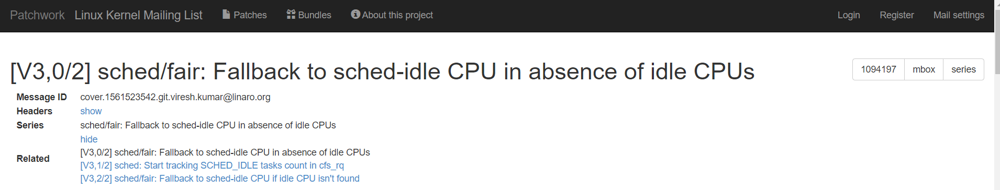

# 对内核补丁 [[V3,0/2] sched/fair: Fallback to sched-idle CPU in absence of idle CPUs](https://lore.kernel.org/patchwork/cover/1094197/) 详解
-------

## 
简要说明

当前处于 : `[V3,0/2] sched/fair: Fallback to sched-idle CPU in absence of idle CPUs`
`V3`表示第三版,`0/2`表示当前为概述,且后续有两篇有序的`patch`。
右上角的`mbox`点击会下载一份`.mbox`文件,内容即是`Message`。
右上角的`series`点击会下载一份`.patch`文件,内容包含这组`patch`的所有改动。

-------
## 
概述

-------
## 
 [V3,0/2] sched/fair: Fallback to sched-idle CPU in absence of idle CPUs 

### Message

### Comments

-------
## 
 [V3,1/2] sched: Start tracking SCHED_IDLE tasks count in cfs_rq 

### Commit Message

### Patch

-------
## 
 [V3,2/2] sched/fair: Fallback to sched-idle CPU if idle CPU isn't found 

### Commit Message

### Patch

### Comments